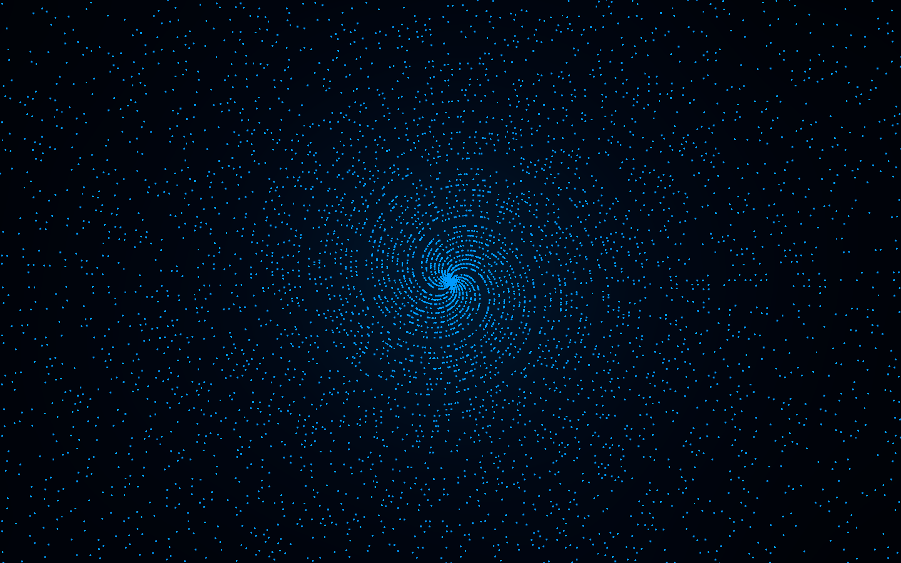

# polar_primes

**Render prime numbers as a polar spiral (Sacks spiral) — as a PNG image or a 3D point cloud.**



Every prime `p` is plotted at polar coordinates `(r, θ) = (p · scale, p · angle_step)`.
With the default `angle_step = 1.0` rad this produces the classic **Sacks spiral** — an
Archimedean spiral where the primes line up along visible rays, revealing their
distribution in a way a plain number line never can.

```bash
cargo run -- --n 100000 --color cyan
```

---

## Features

- ⚡ **Fast** — sieve of Eratosthenes, renders 100k+ primes in well under a second
- 🖼️ **PNG output** — RGBA, alpha-blended dots, opaque black background
- 🎨 **Colors** — `#RRGGBB`, `#RRGGBBAA` or common CSS names (`cyan`, `magenta`, …)
- 📐 **Two scaling modes** — absolute (`--scale`) or relative to the image (`--fill`),
  independent of `--n` so the spiral extent never changes when you add more primes
- ↔️ **Offsets** — shift the spiral center as a fraction of the half-image
- 🧊 **3D export** — `.xyz` point cloud (one atom per prime) for OVITO, VMD, Avogadro, Jmol…
- 📦 **Zero bloat** — single file, two small dependencies (`png`, `chrono`)

## The math

For each prime `p`:

```
angle  θ = p · angle_step        (radians)
radius r = p · scale
x = cx + r · cos(θ)
y = cy + r · sin(θ)
```

`angle_step = 1.0` gives the Sacks spiral. Other values produce interesting
variants — try `--angle-step 0.5` or `--angle-step 2.39996` (the golden angle).

## Build

Requires [Rust](https://rustup.rs) (edition 2024).

```bash
cargo build --release
```

## Usage

```text
polar_primes [options]

--n <int>             primes up to n (default 1000)
--width <int>         image width in px (default 1000)
--height <int>        image height in px (default 1000)
--scale <float>       absolute px per integer; > 0 overrides --fill
--fill <float>        fraction of the image the spiral spans, independent
                      of --n (default 1.0; > 1 crops the outer primes)
--dot-radius <float>  dot radius in px (default 1.5)
--angle-step <float>  radians per integer (default 1.0 = Sacks spiral)
--color <color>       #RRGGBB, #RRGGBBAA or a name (default white)
--offset-x <float>    shift center horizontally, fraction of half-image
                      (0.5 = half of the half-width right; default 0)
--offset-y <float>    shift center vertically, fraction of half-image
                      (positive = down; default 0)
--output <file>       PNG output name (default image_YYYYMMDD.png)
--export-xyz <file>   also write a 3D point cloud (.xyz, one atom per prime)
--z-scale <float>     z units per integer for the .xyz export
                      (0 = same as the PNG radius scale)
```

### Examples

Classic Sacks spiral, 4K, cyan dots:

```bash
cargo run --release -- --n 100000 --width 3840 --height 3840 --color cyan --output sacks.png
```

Golden-angle variant (sunflower-like phyllotaxis pattern):

```bash
cargo run --release -- --n 50000 --angle-step 2.39996 --color magenta
```

Push the spiral off-center and let it crop:

```bash
cargo run --release -- --n 20000 --fill 1.4 --offset-x -0.5 --offset-y 0.3
```

## 3D export

`--export-xyz` writes an [extended XYZ](https://en.wikipedia.org/wiki/XYZ_file_format)
point cloud: one atom per prime. The 2D spiral is embedded in 3D as a **helix** —
x/y keep the polar position, z rises linearly with the prime value:

```bash
cargo run --release -- --n 50000 --export-xyz spiral.xyz
```

```
5133
polar_primes: Sacks spiral as 3D helix, n=50000, angle_step=1, scale=0.009990, z_scale=0.009990
C 1.998000 0.909297 1.998000
C 2.283228 -1.832921 2.997000
...
```

Use `--z-scale` to stretch or compress the helix independently of the radius.
Good free viewers for `.xyz` files:

| Viewer | Notes |
|--------|-------|
| [OVITO](https://www.ovito.org) | best for large point clouds, publication-quality renders |
| [VMD](https://www.ks.uiuc.edu/Research/vmd/) | classic MD viewer |
| [Avogadro 2](https://avogadro.cc) | nice renderer; disable bond perception for point clouds |
| [Jmol](https://jmol.sourceforge.net) | lightweight quick look |

## Project structure

```
polar_primes/
├── Cargo.toml      # manifest: png, chrono
├── LICENSE         # MIT
├── README.md
└── src/
    └── main.rs     # everything: sieve, render, PNG + XYZ writers, CLI
```

## License

[MIT](LICENSE) © 2026 Adrenocrom

---

## Built with AI 🤖

This project was developed in collaboration with **Sven**, an AI coding agent.
The code, tooling decisions and documentation were produced through an
iterative human–AI pair-programming workflow — the human had the idea,
Sven did the typing.
